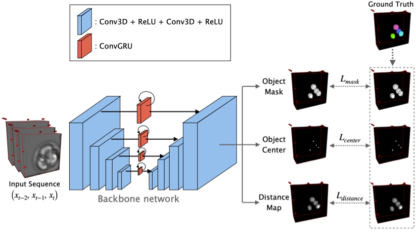

# FL<sup>2</sup>-Net: Four-dimensional Label-Free Live cell image segmentation Network

This is the code for [Four-dimensional label-free live cell image segmentation for predicting live birth potential of embryos]().
This project is carried out in cooperation with [Funahashi Lab. at Keio University](https://fun.bio.keio.ac.jp/) and Yamagata Lab. at Kindai University.
The images below are time-series 3D bright-field microscopy image and segmentation image by the proposed method.
The 3D images visualized with 3D viewer plugin [[1]](#references) of Fiji.


## Overview

FL<sup>2</sup>-Net is a deep learning-based segmentation method using the spatio-temporal feature in embryogenesis.
FL<sup>2</sup>-Net performs instance segmentation of the time-series 3D bright-field microscopy images at each time point, and the quantitative criteria for mouse development are extracted from the acquired time-series segmentation image.



## Performance

Our method performs State-of-the-Art on time-series 3D bright-field microscopy images by considering time-series information, 
but ours w/o considering time-series information (Ours w/o GRU) also performs better than the existing methods.
The segmentation accuracy below is represented by AP<sub>dsb</sub> with IoU thresholds ranging from 0.1 to 0.9

| IoU threshold              | 0.1               | 0.2               | 0.3               | 0.4               | 0.5               | 0.6               | 0.7               | 0.8               | 0.9               |
|----------------------------|-------------------|-------------------|-------------------|-------------------|-------------------|-------------------|-------------------|-------------------|-------------------|
| FL<sup>2</sup>Net          | **0.866**         | **0.861**         | **0.852**         | **0.836**         | **0.808**         | **0.763**         | **0.677**         | **0.454**         | **0.023**         |
| FL<sup>2</sup>Net (w/o GRU)| 0.870             | 0.863             | 0.850             | 0.829             | 0.795             | 0.738             | 0.642             | 0.405             | 0.012             |
| QCANet[[2]](#references)         | 0.848             | 0.834             | 0.814             | 0.786             | 0.745             | 0.683             | 0.576             | 0.320             | 0.005             |
| EmbedSeg[[3]](#references)       | 0.817             | 0.813             | 0.807             | 0.797             | 0.755             | 0.728             | 0.614             | 0.333             | 0.007             |
| StarDist[[4]](#references)       | 0.569             | 0.551             | 0.513             | 0.458             | 0.389             | 0.291             | 0.134             | 0.006             | 0.000             |


## QuickStart

1. Download this repository by `git clone`.

   ```sh
   % git clone https://github.com/funalab/BFsegmentation.git
   ```

2. Install requirements.

   ```sh
   % cd BFsegmentation/
   % python -m venv venv
   % source ./venv/bin/activate
   % pip install -r requirements.txt
   ```

3. Inference on example test dataset.
  
   Currently we provide some pretrained models for 3d and 3d+t bright-feild microscopy image.
   * [trained_model.pth](https://drive.usercontent.google.com/download?id=1PUYnMA7-El0OtJNHR-gDxwBzD7yP_g7V&confirm=xxx) : model trained using `confs/model/gru3.yaml`
   * [trained_model_woGRU.path](https://drive.usercontent.google.com/download?id=1v0HN7SwbvvP7q71XNXVj1pdjlPPW0R1C&confirm=xxx) : model without GRU (Gated recurrent unit) trained using `confs/model/base.yaml`  

   Run the following command to segment brigh-field images in `datasets/examples/raw`.
   The segmentation images will be generated in the `results/test_example_[time_stamp]/Predictions`.
   The expected output of this segmentation is stored in `images/example_output`. 

   ```sh
   % wget -O models/trained_model.pth https://drive.usercontent.google.com/download?id=1PUYnMA7-El0OtJNHR-gDxwBzD7yP_g7V&confirm=xxx
   % CUDA_VISIBLE_DEVICES=1 python src/test.py \
      --test_conf confs/test/test_example.yaml \
      --model_conf confs/model/gru3.yaml \
      -o results/test_example \
      -m models/trained_model.pth \
      --save_img
   ```

## Training and Inference on your data
   This repository uses [AttrDict](https://github.com/bcj/AttrDict) to access config values as attribute.
   For training and inference on your data, set config with reference to `confs/runtime/base.yaml` and `confs/test/test.yaml`.
   
   * runtime/inference config (e.g. `confs/runtime/base.yaml` / `confs/test/test.yaml`)
     * `cfg.DATASETS.DIR_NAME.RAW` : Specify directory path of raw images.
     * `cfg.DATASETS.DIR_NAME.INSTANCE` : Specify directory path of ground truth images for instance segmentation.
     * `cfg.DATASETS.SPLIT_LIST` : Specify the path of the file in which the input file name used for training/validation/test is enumerated.
     * `cfg.DATASETS.RESOLUTION` : Specify microscopy resolution of x-, y-, and z-axis. (defalt=1.0:1.0:2.18)

   * model config  (e.g. `confs/model/base.yaml` / `confs/model/gru3.yaml`)  

1. **Training**:  
   Run the following command to train segmentation model on the datasets/input_example dataset.
   The training results will be generated in the `results/train_[time_stamp]` directory, and
   trained models will be stored sequentially in the `results/train_[time_stamp]/trained_models`.

   ```sh
   % CUDA_VISIBLE_DEVICES=[GPU ID] python src/train.py \
      --runtime_conf confs/runtime/base.yaml \
      --model_conf confs/model/base.yaml \
      -o results/train
   ```

2. **Validation**:  
   Pass the directory path that stores the models genereted by the training process (`results/train_[time_stamp]/trained_models`) to the argument `-m`.
   Run the following command to validate generated models and get best model.
   ```sh
   % CUDA_VISIBLE_DEVICES=[GPU ID] python src/validation.py \
      --test_conf confs/test/validation.yaml \
      --model_conf confs/model/base.yaml \
      -m [path/to/models/directory] \
      -o results/val
   ```
   
3. **Test**:  
   Pass the best-model path selected by validation process to the argument `-m`.
   The segmentation images will be generated in the `results/test_[time_stamp]/Predictions`.
   If you want to evaluate segmentation accuracy, use the argument `--evaluation`.
   ```sh
   % CUDA_VISIBLE_DEVICES=[GPU ID] python src/test.py \
      --test_conf confs/test/test.yaml \
      --model_conf confs/model/base.yaml \
      -m [path/to/trained/model] \
      -o results/test \
      --save_img
   ```

4. **Extraction of quantitative criteria of time-series data**:  
   Pass the directory path that stores the segmentation images outputted by process 3 (`results/test_[time_stamp]/Predictions`) to the argument `-i`.
   Extracted quantitative criteria will be exported to `criteria.csv`.
   ```sh
   % python -i [path/to/segmentation/images] -o results/feat
   ```

5. **Live birth potential prediction**:  
   [Normalized Multi-View Attention Network (NVAN)](https://github.com/funalab/NVAN) performs 
   the prediction of live birth potential of embryo using the time-series segmentation images extracted by segmentation (`criteria.csv`)  

**NOTE**
- The pair of image and ground truth must be the same name `T.tif` (T: temporal index composed of three digits).  
- The timepoint index is assumed to start from 1 by default. If you want to change it, set `cfg.DATASETS.BASETIME`.
- For time-series images, `confs/model/gru3.yaml` is recommended for higher performance. If you want to perform time-independent segmentation, `confs/model/base.yaml`, which offers a smaller model, is recommended.  
 
## Acknowledgement

The microscopy images included in this repository is provided by Yamagata Lab., Kindai University.
The development of this algorithm was funded by JST CREST (Grant Number JPMJCR2331) to [Akira Funahashi](https://github.com/funasoul).

## References

<a id="ref1"></a> [[1] Schmid, Benjamin, et al. "A high-level 3D visualization API for Java and ImageJ." BMC bioinformatics 11, 274 (2010).](https://bmcbioinformatics.biomedcentral.com/articles/10.1186/1471-2105-11-274)  
<a id="ref2"></a> [[2] Yuta, Tokuoka, et al. "3D convolutional neural networks-based segmentation to acquire quantitative criteria of the nucleus during mouse embryogenesis." NPJ systems biology and applications 6, 32 (2020).](https://www.nature.com/articles/s41540-020-00152-8)  
<a id="ref3"></a> [[3] Manan, Lalit, et al. " EmbedSeg: Embedding-based Instance Segmentation for Biomedical Microscopy Data." Medical image analysis 81, 10523 (2022).](https://www.sciencedirect.com/science/article/abs/pii/S1361841522001700)  
<a id="ref4"></a> [[4] Martin, Weigert, et al. "Star-convex Polyhedra for 3D Object Detection and Segmentation in Microscopy."  in Proceedings of the IEEE/CVF Winter Conference on Applications of Computer Vision 3666–3673 (2020).](https://openaccess.thecvf.com/content_WACV_2020/html/Weigert_Star-convex_Polyhedra_for_3D_Object_Detection_and_Segmentation_in_Microscopy_WACV_2020_paper.html)  
